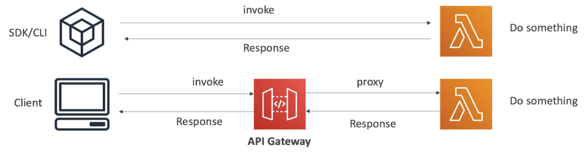

# AWS
Appunti su alcuni servizi di AWS.

# Identity and Access Management (IAM)
Un *AWS Account* è un contenitore di **Identity** e **Risorse** che quando creato include un **root user**, il quale ha pieno controllo dell'account (è buona norma non operare con il root user).<br>
IAM sta per **Identity and Access Management** ed è un servizio globale che permette di gestire facilmente autenticazione e autorizzazione delle risorse.<br>
Ci sono 3 diverse tipologie di identities: **User**, **Group**, **Role**.


## IAM User
È un'**identità permanente** per <u>garantire accessi a lungo termine ad una persona o un'applicazione</u>. Ad esempio creare un utente per utilizzare la cli di AWS oppure un utente per ogni membro del team.<br>
Gli utenti si **autenticano** con le credenziali *user & password* oppure con *access key*.

In IAM è importante il concetto di **Principal**, ovvero una persona fisica, un’applicazione, un device o processo che si vuole autenticare in AWS. Un **Anonymous Principal** è un utente non autenticato, cioè qualcuno che accede a una risorsa AWS senza fornire credenziali.<br>


## IAM Group
Sono dei <u>contenitori di IAM User</u> che ne semplificano la gestione, ad esempio il team Finance/Engineering/HR ...<br>
È possibile definire delle **Identity Policy** al gruppo, che si applicano a tutti gli utenti all'interno di quel gruppo. Non è possibile autenticarsi come un gruppo.
I gruppi non sono delle **true identity** e quindi non è possibile definire delle *Resource Policy* (non si può definire il concetto *"a questo bucket S3 può accedere questo gruppo"*)

## IAM Role
Se un IAM User è pensato per autenticare un singolo Principal, <u>IAM Role è adatto quando non sappiamo a priori chi saranno i *Principal*</u> (eventualmente anche un numero grande). Invece che autorizzare principal identificati, autorizziamo tutti i principal (non sappiamo quali e quanti) che hanno un determinato ruolo.<br>

Entità diverse possono assumere un ruolo per ottenere permessi:
- l'IAM User *mario rossi* assume il ruolo admin per fare operazioni amministrative
- un'istanza EC2 assume un ruolo per accedere ad S3

I ruoli generalmente sono utilizzati su base temporanea, quindi quando viene assunto un ruolo vengono generate delle credenziali a breve durata:
```text
1. Crei IAM Role "EC2-S3-Access"
2. Un'istanza EC2 "assume" questo ruolo
3. AWS genera credenziali temporanee valide per 1 ora
4. Dopo 1 ora, le credenziali scadono
5. AWS genera automaticamente NUOVE credenziali temporanee
```

I ruoli sono delle **real identity** a differenza dei gruppi e quindi possono essere referenziate dalle *Resource Policy*.<br>


## IAM Policy
Le policy in AWS sono **documenti JSON** che <u>definiscono i permessi di accesso alle risorse AWS (chi può fare cosa, su quali risorse e in quali condizioni)</u>.
```json
{
 "Version": "2012-10-17",
 "Statement": [
   {
     "Effect": "Allow", // Allow or Deny
     "Action": "s3:GetObject", // What kind of action
     "Resource": "arn:aws:s3:::nome-bucket/*" // Destination resource
   }
 ]
}
```

### Identity Based Policy
Sono policy (sia *Managed* che *Inline*) che <u>assegnano permessi ad utenti, gruppi o ruoli IAM</u> e rappresentano la scelta standard e consigliata.<br>
Esempio di una policy per un IAM User:
```json
{
  "Version": "2012-10-17",
  "Statement": [
    {
      "Effect": "Allow",
      "Action": "s3:ListBucket",
      "Resource": "arn:aws:s3:::mio-bucket-produzione"
    }
  ]
}
```

### Resource Based Policy
Policy che assegnano permessi direttamente a una risorsa AWS. La referenza viene fatta tramite ARN (ad esempio un bucket S3 permette accesso solo ad una lambda specifica).<br>
A differenza delle Identity Policy possono permettere/negare operazioni ad Identity anche esterne all’account AWS (accesso cross-account) oppure ad Anonymous Principals.<br>
Esempio di una policy per una Lambda:
```json
{
  "Version": "2012-10-17",
  "Statement": [
    {
      "Sid": "AllowLambdaAccess",
      "Effect": "Allow",
      "Principal": {
        "AWS": "arn:aws:iam::123456789012:role/MyLambdaRole"
      },
      "Action": [
        "s3:GetObject",
      ],
      "Resource": "arn:aws:s3:::mio-bucket/*"
    }
  ]
}
```

### Role Policy
Quando definiamo i permessi sui ruoli abbiamo due tipi di policy.<br>

Le **Trust Policy** sono una *resource based policy* e definiscono chi può assumere il ruolo.<br>
Quando un ruolo viene assunto da un’identità, AWS genera security credentials temporanee utilizzate da tale identità (simili agli access key ma con limiti temporali). Il servizio che genera le credenziali è **Secure Token Service (STS)**.

Le **Permission Policy** sono *identity based policy* e definiscono cosa può fare chi assume un ruolo.

```
┌─────────────────────────────────────────┐
│         IAM ROLE: "AppRole"             │
├─────────────────────────────────────────┤
│                                         │
│  📋 TRUST POLICY                        │
│  ┌───────────────────────────────────┐  │
│  │ WHO can assume?                   │  │
│  │ • ec2.amazonaws.com               │  │
│  │ • lambda.amazonaws.com            │  │
│  │ • arn:aws:iam::999:user/external  │  │
│  └───────────────────────────────────┘  │
│           ↓ (if allowed)                │
│                                         │
│  🔐 STS generates temporary creds       │
│  ┌───────────────────────────────────┐  │
│  │ • AccessKeyId (ASIA...)           │  │
│  │ • SecretAccessKey                 │  │
│  │ • SessionToken                    │  │
│  │ • Expiration (1-12 hours)         │  │
│  └───────────────────────────────────┘  │
│           ↓ (identity uses creds)       │
│                                         │
│  🔑 PERMISSION POLICIES                 │
│  ┌───────────────────────────────────┐  │
│  │ WHAT can they do?                 │  │
│  │ • s3:GetObject                    │  │
│  │ • dynamodb:PutItem                │  │
│  │ • logs:CreateLogStream            │  │
│  └───────────────────────────────────┘  │
│           ↓ (if allowed)                │
│                                         │
│  ✅ Access to Resources                 │
└─────────────────────────────────────────┘
```

### How to define policies (Managed vs Inline)
Le **Managed Policy** vengono prima create e successivamente assegnate a utenti, ruoli, gruppi. Quindi riutilizzabili e una modifica alla policy si ripercuote a tutte le identity che hanno tale policy assegnata.<br>
Le Inline Policy definite direttamente per uno specifico utente, ruolo o gruppo. Utile se vogliamo garantire access/deny specifici per una identity.

# Lambda
*It is a computation service that runs your code in response to events and automatically manages the compute resources*.<br>
Alcune caratteristiche:
- **Serverless**: non dobbiamo gestire manualmente le risorse. AWS scala in automatico in base al traffico
**Short live**: l'esecuzione può durare massimo **15 minuti**
- Eseguita **on-demand** quando viene ricevuto un evento
- **Stateless** poiché non viene mantenuto uno stato tra le richieste

Di una lambda possiamo <u>specificare la memoria da 128MB a 10GB e la CPU è allocata di conseguenza in base alla RAM selezionata</u>. Lo spazio su dove viene memorizzato il codice è limitato a 10GB di memoria.

## Lambda Instances
Una richiesta viene presa da un'istanza di una lambda. Quando non c'è un'istanza disponibili, viene creata una sorta di *virtual machine*: questo processo è chiamato **cold start**. Per ottimizzare le risorse un'istanza non viene rimossa subito dopo aver processato un evento, ma rimane in *idle* per eventuali richieste imminenti. Quando un'istanza è disponibile per processare un nuovo evento viene nominato **warm start**<br>
Ci possono essere al massimo <u>1000 istanze attive contemporaneamente in una regione</u>.

Quando implementiamo una lambda è opportuno porre attenzione alla fase chiamata **init phase**. Per operazioni più dispendiose, come le inizializzazioni di connessioni a database o client TCP, è buona norma farlo *globalmente* in modo tale che più richieste in sequenza processate da un'istanza eseguano queste operazioni solo una volta e possano riutilizzare le risorse.

## Lambda Pricing
Il costo di un'esecuzione di una richiesta è dato da: $execution\_time * execution\_cost$.<br>
Il <u>tempo di esecuzione è pari al tempo necessario per processare una richiesta</u>, mentre il <u>costo di esecuzione dipende dalla memoria allocata per la lambda</u>.

Alcuni prezzi per le regione *eu-central-1 (Frankfurt)*:
| Memoria (MB) | Prezzo per 1 millisecondo |
|--------------|---------------------------|
| 128          | 0,0000000021 USD          |
| 512          | 0,0000000083 USD          |
| 1.024        | 0,0000000167 USD          |

Inoltre AWS Lambda ha un <u>costo in base al numero di richieste indipendente dalla memoria allocata, pari a circa 0.20$ per ogni 1kk chiamate</u>.

## Sync vs Async Lambdas
Le lambda possono essere invocate in modo **sincrono**, ad esempio da una CLI/SDK oppure una chiamata HTTP ad un API Gateway che inoltra la richiesta alla lambda. Quando il client che invoca la lambda attende la risposta<br>


Le lambda possono essere invocate in modo asincrono da altri servizi integrati, come S3, SNS, etc. <u>A fronte di un errore la lambda viene eseguita 3 volte dopo alcuni intervalli di tempo</u>. Se è buona norma configurare una DLQ per i messaggi in errore.<br>
Un'altra cosa a cui prestare attenzione è l'**idempotenza**. Non abbiamo la garanzia che un evento venga ricevuto solamente una volta, quindi configurare la lambda per evitare processi multipli della stessa richiesta.

## Lambda use cases
Alcuni casi d'uso e limitazioni delle lambda.

Casi d'uso:
- uno scenario tipico è REST API + API Gateway + Lambda
- background processing
- applicazioni che vengono eseguite in maniera spot o dove è necessario gestire picchi di carico non prevedibili

Limitazioni:
- non utilizzare per *long-running jobs*, statefull application
- non utilizzare se necessario mantentere *web socket* aperte (ad esempio real time application)
- limiti dei payload 6MB per invocazioni sincrone, 256KB per quelle asincrone
